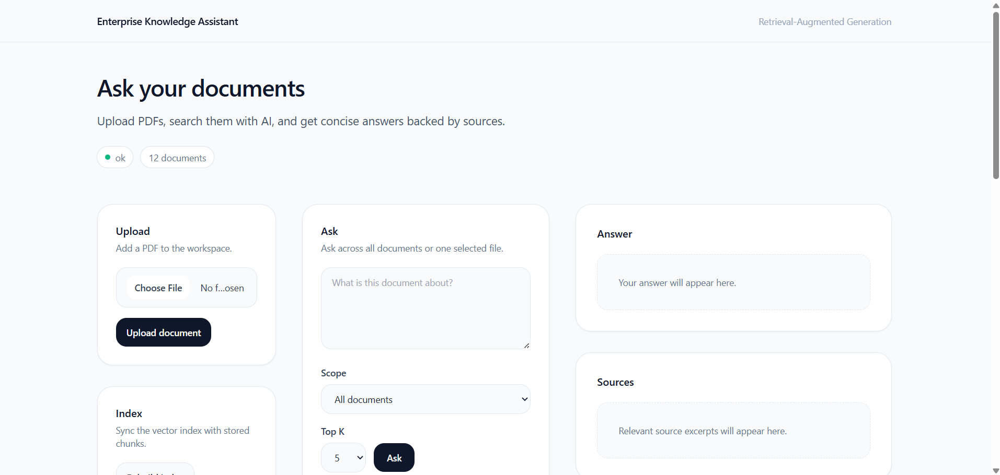
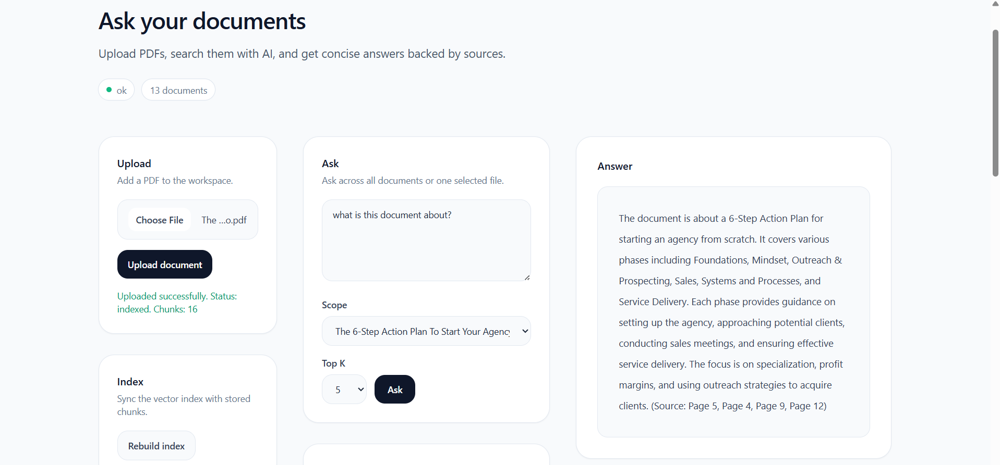
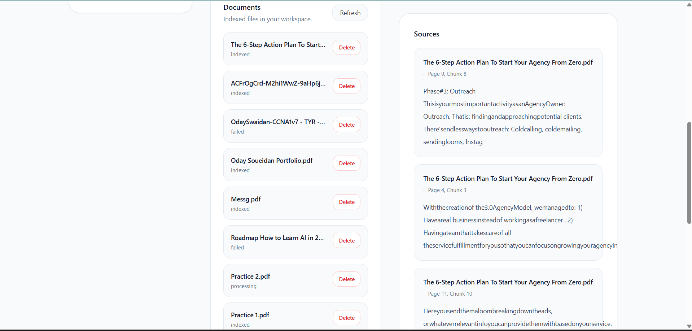
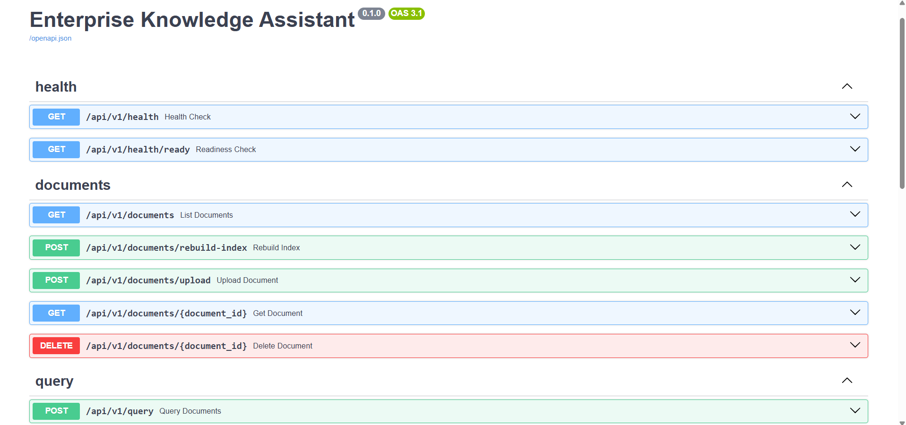

# Enterprise Knowledge Assistant

Production-style AI knowledge assistant built with Retrieval-Augmented Generation (RAG) for enterprise document search and question answering.

## Live Demo

- Frontend: `http://98.92.140.134`
- API Docs: `http://98.92.140.134/docs`

> Note: Demo may be usage-limited to control API costs.

---

## Overview

This project ingests PDF documents, extracts and chunks text, generates embeddings with OpenAI, stores vectors in FAISS, and answers questions using retrieved context through a FastAPI backend and a React frontend.

It is designed as a **production-style AI application**, not a toy demo, with a clean backend architecture, modular services, metadata persistence, vector retrieval, Dockerized deployment, and a polished frontend experience.

---

## Features

- PDF upload and ingestion pipeline
- Text extraction, cleaning, and chunking
- OpenAI embeddings
- FAISS vector search
- Retrieval-Augmented Generation (RAG)
- Source-aware answers with citations
- Query across all documents or a selected document
- SQLite metadata tracking with SQLAlchemy
- Duplicate document detection via content hashing
- Rebuildable vector index
- Document delete + reindex workflow
- FastAPI backend with modular architecture
- React + Vite + Tailwind frontend
- Dockerized frontend/backend deployment
- AWS EC2 deployment
- Structured logging and request tracing

---

## Screenshots

### Main Workspace


### Query Result


### Documents View


### API Docs


---

## Tech Stack

### Backend
- Python 3.11
- FastAPI
- SQLAlchemy
- SQLite
- FAISS
- OpenAI API
- PyPDF

### Frontend
- React
- Vite
- TypeScript
- Tailwind CSS
- Axios

### DevOps / Deployment
- Docker
- Docker Compose
- AWS EC2
- GitHub Actions

---

## Architecture
```text
Client (React + Vite + Tailwind)
        │
        ▼
FastAPI Backend
  ├── Document Upload / Ingestion
  │     ├── PDF parsing
  │     ├── Text cleaning
  │     ├── Chunking
  │     ├── OpenAI embeddings
  │     └── FAISS indexing
  │
  └── Query / RAG Service
        ├── Query embedding
        ├── Vector retrieval
        ├── Prompt assembly
        └── OpenAI answer generation

Storage Layer
  ├── Raw PDF files
  ├── SQLite metadata DB
  └── FAISS vector index
```

## Project Structure
```text
app/
  api/
  core/
  db/
  embeddings/
  ingestion/
  llm/
  repositories/
  retrieval/
  schemas/
  services/
  storage/
  utils/
frontend/
data/
scripts/
tests/
docs/
```

## Core API Endpoints

- `GET /api/v1/health`
- `GET /api/v1/health/ready`
- `GET /api/v1/documents`
- `GET /api/v1/documents/{document_id}`
- `POST /api/v1/documents/upload`
- `DELETE /api/v1/documents/{document_id}`
- `POST /api/v1/documents/rebuild-index`
- `POST /api/v1/query`

## Example Query Request
```json
{
  "question": "What is this document about?",
  "top_k": 5,
  "document_id": null
}
```

## Example Query Response
```json
{
  "answer": "The document discusses ...",
  "sources": [
    {
      "chunk_id": "chunk-id",
      "document_id": "doc-id",
      "filename": "sample.pdf",
      "page_number": 1,
      "chunk_index": 0,
      "text_preview": "..."
    }
  ]
}
```

## Local Setup

### 1. Clone the repository
```bash
git clone https://github.com/oday198/enterprise-knowledge-assistant.git
cd enterprise-knowledge-assistant
```

### 2. Create environment
```bash
python -m venv .venv
source .venv/bin/activate
```

### 3. Install dependencies
```bash
pip install -e ".[dev]"
```

### 4. Configure environment
Copy `.env.example` to `.env` and set `OPENAI_API_KEY`

### 5. Run backend
```bash
uvicorn app.main:app --reload
```

### 6. Run frontend
```bash
cd frontend
npm install
npm run dev
```

---

## Docker
```bash
docker compose up --build
```

- Frontend: `http://localhost`
- API Docs: `http://localhost/docs`

---

## Deployment

Recommended deployment: AWS EC2 with Docker Compose

High-level deployment flow:
1. Launch Ubuntu EC2 instance
2. Install Docker + Docker Compose
3. Clone repository
4. Create `.env` from production template
5. Run `docker compose up --build -d`
6. Expose port 80

---

## Testing
```bash
pytest -q
```

GitHub Actions CI is included for automated test runs on push/pull request.

---

## Key Engineering Decisions

- Modular monolith architecture for simplicity and production clarity
- FAISS abstraction layer to keep vector store replaceable
- Metadata DB + vector index separation
- Duplicate detection by content hash
- Document-scoped querying in addition to global querying
- Dockerized deployment for reproducibility
- Frontend + backend separation for cleaner architecture

---

## Future Improvements

- Background async ingestion
- Authentication / access control
- Rate limiting
- Managed vector DB option
- Cloud object storage for PDF files
- LLM response caching
- Better observability and metrics
- Reranking for retrieval quality

---

## Author

Oday Soueidan
LinkedIn: https://www.linkedin.com/in/odaysoueidan
GitHub: https://github.com/oday198